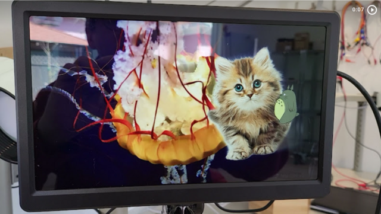

# Pivid

* [Building and running Pivid](doc/running.md)
* [Architecture overview](doc/architecture.md)
* [REST API protocol](doc/protocol.md)
* [Play script format](doc/script.md)
* [Development notes and links](doc/notes.md)

## Introduction

Pivid is a nonlinear, gapless, direct-rendering, multi-head video playback and
compositing engine based on [libav](https://libav.org/), optimized for the
[Raspberry Pi](https://www.raspberrypi.org/) and controlled with a JSON/REST API.
Pivid is intended for escape rooms, immersive experiences, video performances
and similar applications.

### Advantages

Pivid can splice, overlay, scale, transition, seek and loop videos
with no gaps and frame-perfect rendering. The [play script](doc/script.md)
(playback instructions) may be updated at any time; preload hints may
be provided to ensure gapless changes.

Playback position, media layout onscreen, and layer opacity are specified as
(1-D) cubic Bezier functions of time, enabling flexible animation and
transition effects. Still images are considered one-frame videos and may be
layered with moving video content, including alpha-channel transparency support.

Pivid uses Linux
[Direct Rendering](https://en.wikipedia.org/wiki/Direct_Rendering_Manager)
(with [Atomic Display](https://en.wikipedia.org/wiki/Direct_Rendering_Manager#Atomic_Display))
for fast full screen playback. When playing 
[H.264/AVC](https://en.wikipedia.org/wiki/Advanced_Video_Coding) or
[H.265/HEVC](https://en.wikipedia.org/wiki/High_Efficiency_Video_Coding)
video content on the
[Raspberry Pi 4B](https://www.raspberrypi.com/products/raspberry-pi-4-model-b/),
Pivid uses the GPU and
[DMA buffers](https://en.wikipedia.org/wiki/Direct_Rendering_Manager#DMA_Buffer_Sharing_and_PRIME)
for zero-copy decoding, buffering, compositing and display.

Pivid is open source, available under the [MIT license](LICENSE.md).

### Limitations

Unlike apps like [VLC](https://www.videolan.org/vlc/) or
[Kodi](https://kodi.tv), Pivid has no user interface and is only
useful driven by other software.

Pivid requires exclusive use of display hardware and does not run
in a window (the desktop must be shut down).

Pivid currently has no audio support (a likely area of upcoming work).

Pivid is "early alpha" status.
[The author](https://github.com/egnor) is excited to hear from you if you're
planning to use it seriously!

Next: [Building and running Pivid](doc/running.md)
