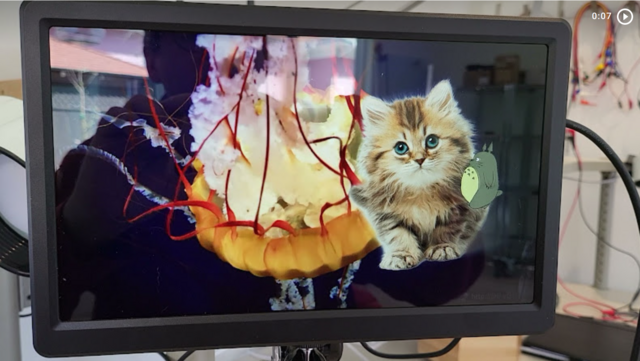

# Pivid

[](https://photos.app.goo.gl/aU5KSJmNnLvrw1gc8)

* [Building and running Pivid](doc/running.md)
* [REST API reference](doc/interface.md)
* [Play script format](doc/script.md)
* [Development notes](doc/notes.md)

## Introduction

Pivid is a [Raspberry Pi](https://www.raspberrypi.org/)-optimized 
nonlinear, gapless, direct-rendering video playback and compositing engine
based on [libav](https://libav.org/) and controlled with a JSON/REST API.
Pivid is intended for escape rooms, immersive experiences, video performances
and similar applications.

Unlike [VLC](https://www.videolan.org/vlc/)-type video player apps, Pivid
has no user interface and is only useful when driven by other software.

Pivid can splice, overlay, scale, transition, seek and loop videos
with no gaps and frame-perfect rendering. Playback configuration (the
[play script](doc/script.md)) may be updated at any time; preload hints may
be provided to ensure gapless changes.

All parameters, including playback position, image positioning, and opacity
are specified as (1-D) cubic Bezier functions of time. Still images are
considered one-frame videos and may be layered with moving video content,
including alpha-channel transparency support.

Pivid does not run under the Raspberry Pi desktop (X windows). Instead,
Pivid uses the Linux
[Direct Rendering Manager](https://en.wikipedia.org/wiki/Direct_Rendering_Manager)
(with [Atomic Display](https://en.wikipedia.org/wiki/Direct_Rendering_Manager#Atomic_Display))
for high performance full screen playback. When playing 
[H.264/AVC](https://en.wikipedia.org/wiki/Advanced_Video_Coding) or
[H.265/HEVC](https://en.wikipedia.org/wiki/High_Efficiency_Video_Coding)
video content on the
[Raspberry Pi 4B](https://www.raspberrypi.com/products/raspberry-pi-4-model-b/),
Pivid uses the GPU and
[DMA-BUF/DRM-PRIME](https://en.wikipedia.org/wiki/Direct_Rendering_Manager#DMA_Buffer_Sharing_and_PRIME)
for zero-copy video decoding, buffering, compositing and display.

Pivid is "early alpha" status and you are recommended to
[contact the author](https://github.com/egnor) if you'd like to use it.
Pivid has no support for audio, which is obviously a major limitation
and a likely area of upcoming work.

Pivid is available under the [MIT license](LICENSE.md).

## Building
1. Use a Raspberry Pi with a fully updated [bullseye](https://www.raspberrypi.com/news/raspberry-pi-os-debian-bullseye/) install and 2G+ RAM.
2. Edit `/boot/config.txt` as follows, and reboot:
```
#dtoverlay=vc4-fkms-v3d  # Comment/remove old dtoverlay=vc4* lines
# Use full KMS and H.265 (HEVC) decoding, 512M CMA for frames
dtoverlay=vc4-kms-v3d,cma-512
dtoverlay=rpivid-v4l2
```
3. Run `./dev_setup.py`. (Works On My Machine™, YMMV)
4. Run `ninja -C build` to run the actual build (this is the only part to repeat after edits).
5. Run binaries from `build` (like `build/pivid_test_playback`).
6. If things get weird, `rm -rf build` and start over with `dev_setup.py`.

Notable programs:

* `pivid_play` - play a video file via KMS/DRM (stop X first)
* `pivid_server` - play a video file via KMS/DRM (stop X first)
* `pivid_save_frames` - split a video file into .tiff images
* `pivid_scan_displays` - scan video drivers, connectors, and available modes
* `pivid_scan_media` - scan media files and optionally list or dump frames
* `pivid_inspect_avformat` - print low level video file details
* `pivid_inspect_kms` - print low level KMS/DRM driver details
* `pivid_inspect_kmsg` - print kernel logs with better timestamps than dmesg
* `pivid_inspect_v4l2` - print low level V4L2 driver details

Use `--help` to see usage (and/or read the source).

## Notes and links

### Raspberry Pi specifics
* [All about accelerated video on the Raspberry Pi](https://forums.raspberrypi.com/viewtopic.php?f=67&p=1901014) - my notes
* [kernel.org: V3D Graphics Driver](https://www.kernel.org/doc/html/v5.10/gpu/v3d.html) - RPi 4 GPU kernel driver docs
* [rpi kernel source: drivers/gpu/drm/vc4](https://github.com/raspberrypi/linux/tree/rpi-5.10.y/drivers/gpu/drm/vc4) - RPi 2D GPU kernel driver
* [rpi kernel source: drivers/gpu/drm/v3d](https://github.com/raspberrypi/linux/tree/rpi-5.10.y/drivers/gpu/drm/v3d) - RPi 4 3D GPU kernel driver
* [rpi kernel source: include/uapi/v3d_drm.h](https://github.com/raspberrypi/linux/blob/rpi-5.10.y/include/uapi/drm/v3d_drm.h) - ioctls for RPi 3D driver
* [Blog post: Exploring Hardware Compositing With the Raspberry Pi](https://blog.benjdoherty.com/2019/05/21/Exploring-Hardware-Compositing-With-the-Raspberry-Pi/) - nice hardware video scaler walkthrough

### Graphics output: DRM and KMS
* [Wikipedia: Direct Rendering Manager](https://en.wikipedia.org/wiki/Direct_Rendering_Manager) - a decent overview
* [Blog post: "From pre-history to beyond the global thermonuclear war"](https://ppaalanen.blogspot.com/2014/06/from-pre-history-to-beyond-global.html) - Linux graphics history
* [LWN article: Atomic mode setting design overview](https://lwn.net/Articles/653071/) - the current KMS API
* [Man page: Direct Rendering Manager - Kernel Mode-Setting](https://manpages.debian.org/testing/libdrm-dev/drm-kms.7.en.html) - incomplete but helpful
* [Man page: Direct Rendering Manager - Memory Management](https://manpages.debian.org/testing/libdrm-dev/drm-memory.7.en.html) - incomplete but helpful
* [kernel.org: Linux GPU Driver Userland Interfaces](https://www.kernel.org/doc/html/v5.10/gpu/drm-uapi.html) - basic notes on the kernel/user interface
* [kernel.org: KMS Properties](https://www.kernel.org/doc/html/v5.10/gpu/drm-kms.html#kms-properties) - exhaustive object property list
* [kernel source: include/uapi/drm/drm.h](https://github.com/torvalds/linux/blob/master/include/uapi/drm/drm.h) and [drm_mode.h](https://github.com/torvalds/linux/blob/master/include/uapi/drm/drm_mode.h) - kernel/user headers
* [kernel source: include/drm/drm_print.h](https://github.com/torvalds/linux/blob/master/include/drm/drm_print.h#L253) - debugging definitions 
* [ST Micro: DRM/KMS Overview](https://wiki.st.com/stm32mpu/wiki/DRM_KMS_overview) - decent general docs from a chip vendor
* [ST Micro: How to trace and debug the framework](https://wiki.st.com/stm32mpu/wiki/DRM_KMS_overview#How_to_trace_and_debug_the_framework) - an especially useful section
* [libdrm](https://gitlab.freedesktop.org/mesa/drm) - library wrapper; see [xf86drm.h](https://gitlab.freedesktop.org/mesa/drm/-/blob/main/xf86drm.h) and [xf86drmMode.h](https://gitlab.freedesktop.org/mesa/drm/-/blob/main/xf86drmMode.h) (not X-specific despite "xf86")
* [libgbm](https://gitlab.freedesktop.org/mesa/mesa/-/tree/main/src/gbm) - GPU allocation helper library; see [gbm.h](https://gitlab.freedesktop.org/mesa/mesa/-/blob/main/src/gbm/main/gbm.h)
* [modetest](https://cgit.freedesktop.org/drm/libdrm/tree/tests/modetest/modetest.c) - command line tool (in the [libdrm-tests](https://packages.debian.org/sid/main/libdrm-tests) Debian package)
* [kmscube](https://gitlab.freedesktop.org/mesa/kmscube) - oft-referenced KMS/GL example program
* [kms++](https://android.googlesource.com/platform/external/libkmsxx/) - C++ KMS wrapper & utilities

### Zero-copy buffer sharing
* [kernel.org: Buffer Sharing and Synchronization](https://www.kernel.org/doc/html/v5.10/driver-api/dma-buf.html#userspace-interface-notes) - kernel buffer management (and user interface)
* [kernel.org: Linux GPU Memory Management - PRIME buffer sharing](https://www.kernel.org/doc/html/v5.10/gpu/drm-mm.html#prime-buffer-sharing) - exporting GPU buffers as "dma-bufs"
* [kernel.org: Video for Linux - Streaming I/O (DMA buffer importing)](https://www.kernel.org/doc/html/v5.10/userspace-api/media/v4l/dmabuf.html) - using "dma-buf" objects in V4L2
* [hello_drmprime](https://github.com/jc-kynesim/hello_drmprime) - nice example of hardware H.264/H.265 sending to DRM/KMS with zero copy

### Video decoding: libav and v4l2
* [libav](https://libav.org/) - video processing libraries [ffmpeg](https://ffmpeg.org/), including encoding and decoding
* [rpi-ffmpeg](https://github.com/jc-kynesim/rpi-ffmpeg/tree/release/4.3/rpi_main) - branch of ffmpeg and libav with Raspberry Pi hardware support (via V4L2)
* [kernel.org: Video for Linux API](https://www.kernel.org/doc/html/v5.10/userspace-api/media/v4l/v4l2.html) - kernel/user interface
* [github issue: Keeping buffers allocated by h264_v4l2m2m](https://github.com/jc-kynesim/rpi-ffmpeg/issues/43) - issues with "buffer stealing" from libav decoders

### Misc links
* [One Dimensional Cubic Bezier Curve](http://www.demofox.org/bezcubic1d.html) - interactive explorer for 1-D cubic Beziers
