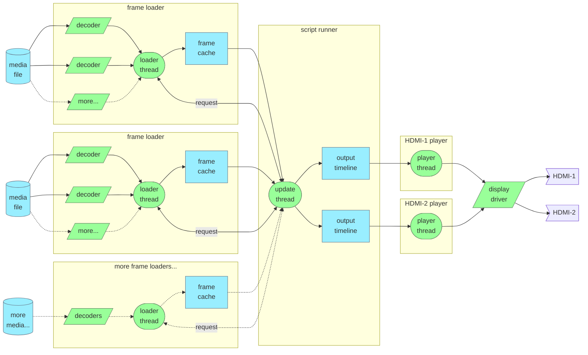

# Pivid architecture overview

```mermaid
flowchart LR
  media_1[(media\nfile)] --> decoder_1a & decoder_1b;
  media_2[(media\nfile)] --> decoder_2a & decoder_2b;
  media_1 -.-> decoder_1z;
  media_2 -.-> decoder_2z;
  media_z[(more\nmedia...)] -.-> decoder_z;

  subgraph loader_sub_1 [frame loader]
    direction LR;
    decoder_1a[/decoder/] & decoder_1b[/decoder/] --> loader_1;
    decoder_1z[/more.../] -.-> loader_1;
    loader_1([loader\nthread]) --> cache_1[frame\ncache];
  end

  subgraph loader_sub_2 [frame loader]
    direction LR;
    decoder_2a[/decoder/] & decoder_2b[/decoder/] --> loader_2;
    decoder_2z[/more.../] -.-> loader_2;
    loader_2([loader\nthread]) --> cache_2[frame\ncache];
  end
  
  subgraph loader_sub_z [more frame loaders...]
    direction LR;
    decoder_z[/decoders/] -.-> loader_z;
    loader_z([loader\nthread]) -.-> cache_z[frame\ncache];
  end
  
  subgraph runner_sub [script runner]
    direction LR;
    cache_1 & cache_2 --> updater([update\nthread]);
    cache_z -.-> updater;
    updater --> timeline_1[output\ntimeline] & timeline_2[output\ntimeline];
    loader_1 & loader_2 <--->|request| updater;
    loader_z <-..->|request| updater;
  end
  
  subgraph player_sub_1 [HDMI-1 player]
    direction LR;
    timeline_1 --> player_1([player\nthread]);
  end
  
  subgraph player_sub_2 [HDMI-2 player]
    direction LR;
    timeline_2 --> player_2([player\nthread]);
  end
  
  player_1 & player_2 --> driver[/display\ndriver/];
  driver --> hdmi_1>HDMI-1] & hdmi_2>HDMI-2];
  
  classDef storage fill:#9ef,stroke:#678;
  class media_1,media_2,media_z,cache_1,cache_2,cache_z,timeline_1,timeline_2 storage;
  
  classDef action fill:#9f9,stroke:#686;
  class loader_1,loader_2,loader_z,updater,player_1,player_2 action;
  class decoder_1a,decoder_1b,decoder_1z,decoder_2a,decoder_2b,decoder_2z,decoder_z,driver action;
```
