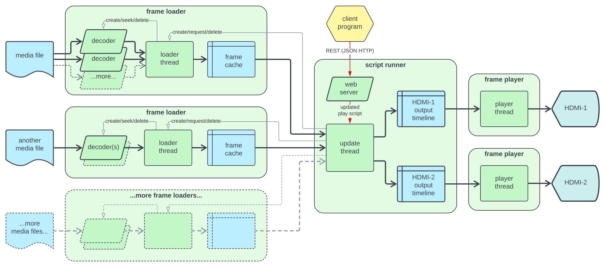

# Pivid architecture overview

To accommodate gapless, nonlinear, changeable playback, Pivid has an
atypical architecture. Instead of linear (FIFO) buffers of frames between
media decoder and playback, Pivid uses nonlinear _frame caches_,
random-access maps of all frames currently loaded for each media file.

The main Pivid update thread creates a _frame loader_ for each media file
referenced in the [play script](script.md). The update thread periodically informs each frame loader which sections of its file will be needed in th
next little while
(typically ~200 milliseconds, but configurable). If a jump or loop is
coming up, or multiple parts of the same video are visible simultaneously, there may be multiple disjoint sections needed.

Each frame loader runs a thread which dynamically creates, uses,
and deletes media decoders, seeking and reading the file to get frames
as needed to fill the cache as requested. Media files often have
limitations on seeking (based on "key frames") so this can be a somewhat
complicated optimization (which Pivid approximates with heuristics). The
loader also removes frames from the cache which are no longer needed.

The frame caches are available to the main update thread (with appropriate
synchronization) which constructs a _timeline_ of the next little while
(again, typically ~200 milliseconds) for each display screen.
Each timeline is a series of output frames, each of which includes all the
input media frames used in that output frame, plus layout directions.

For each active output, a _frame player_ thread follows the timeline.
The timeline may be swapped out at any moment by the main update thread
(with appropriate synchronization) without playback gaps. Collectively,
frame caches and timelines allow input media to be rearranged arbitrarily
into output frames, and allow the remixing instructions to be swapped out
seamlessly.

Pivid can predict upcoming frame needs based on the current script, but
quick script changes (such as sudden starts of new media files) may require
explicit preloading instructions to anticipate.

Actual frame pixels are stored in GPU memory when possible and tracked
with reference-counted pointers, so frames can be processed through frame
caches, the update thread, output timelines and player threads without actually
copying bulk image data.

Next: [REST API protocol](protocol.md)
