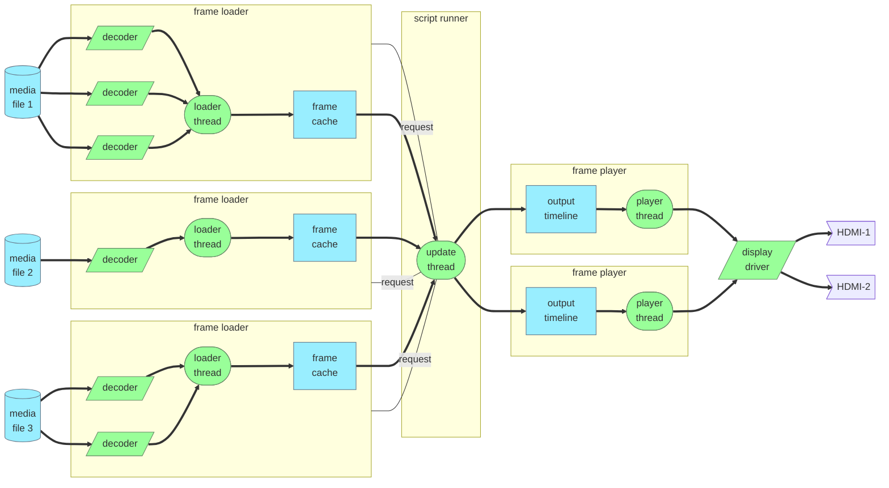

# Pivid architecture overview

```mermaid
flowchart LR
  media_1[(media\nfile 1)] ==> decoder_1a & decoder_1b & decoder_1c;
  media_2[(media\nfile 2)] ==> decoder_2;
  media_3[(media\nfile 3)] ==> decoder_3a & decoder_3b;

  subgraph loader_sub_1 [frame loader]
    direction LR;
    decoder_1a[/decoder/] & decoder_1b[/decoder/] & decoder_1c[/decoder/] ==> loader_1;
    loader_1([loader\nthread]) ==> cache_1[frame\ncache];
  end

  subgraph loader_sub_2 [frame loader]
    direction LR;
    decoder_2[/decoder/] ==> loader_2;
    loader_2([loader\nthread]) ==> cache_2[frame\ncache];
  end
  
  subgraph loader_sub_3 [frame loader]
    direction LR;
    decoder_3a[/decoder/] & decoder_3b[/decoder/] ==> loader_3;
    loader_3([loader\nthread]) ==> cache_3[frame\ncache];
  end
  
  subgraph runner_sub [script runner]
    direction RL;
    %% server[/web\nserver/] -->|script| updater([update\nthread]);
    cache_1 & cache_2 & cache_3 ==> updater([update\nthread]);
  end
  
  %% loader_sub_1 & loader_2 & loader_3 ---|request| updater;
  loader_sub_1 & loader_sub_2 & loader_sub_3 ---|request| updater;
  %% app((user app\nclient)) -->|HTTP| server;
  
  subgraph player_sub_1 [frame player]
    direction LR;
    updater ==> timeline_1[output\ntimeline] ==> player_1([player\nthread]);
  end
  
  subgraph player_sub_2 [frame player]
    direction LR;
    updater ==> timeline_2[output\ntimeline] ==> player_2([player\nthread]);
  end
  
  player_1 & player_2 ==> driver[/display\ndriver/];
  driver ==> hdmi_1>HDMI-1] & hdmi_2>HDMI-2];
  
  classDef storage fill:#9ef,stroke:#678;
  class media_1,media_2,media_3,cache_1,cache_2,cache_3,timeline_1,timeline_2 storage;
  
  classDef action fill:#9f9,stroke:#686;
  class server,loader_1,loader_2,loader_3,updater,player_1,player_2 action;
  class decoder_1a,decoder_1b,decoder_1c,decoder_2,decoder_3a,decoder_3b,driver action;
```
